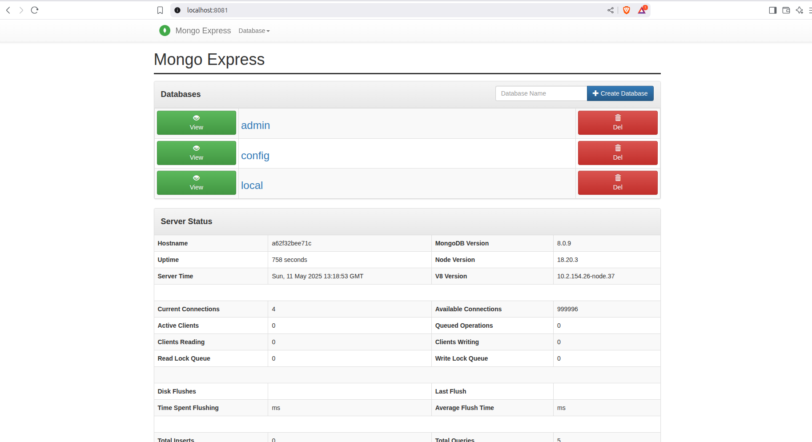

# MongoDB Docker Setup

This repository contains a `docker-compose.yml` file to set up a MongoDB database and MongoDB Express, a web-based MongoDB admin interface.

## Prerequisites

- Docker installed on your system.
- Docker Compose installed.


## Usage

1. Clone this repository or navigate to your project directory.

2. Ensure you have the following mongodb-docker-compose.yml file in your directory:

3. Start the services using the following command:

```bash
 docker compose -f mongodb-docker-compose.yml up -d --build
```

4. Verify that the containers are running: 

```bash 
docker ps 
```

5. Access MongoDB Express:
    Open your browser and navigate to `http://localhost:8081`.
    (if you see not found page then, run this following command in termianl)

    ```bash
    docker exec -it mongodb mongosh --username user --password root --authenticationDatabase admin 
    ```

    - Credential for Admin Login: admin/pass

    Below is an example of the admin page:

    

6. Connect to MongoDB:
    - Host: `mongodb`
    - Port: `27017`

## Configuration

The `docker-compose.yml` file includes the following services:

- **MongoDB**:
  - Image: `mongo:latest`
  - Ports: `27017:27017`
  - Default storage is persisted using a Docker volume.

- **MongoDB Express**:
  - Image: `mongo-express:latest`
  - Ports: `8081:8081`
  - Environment variables for connecting to MongoDB are pre-configured.

## Stopping the Services

To stop and remove the containers, run:

```bash
docker-compose -f mongodb-docker-compose.yml down
```

## License

This project is licensed under the MIT License.